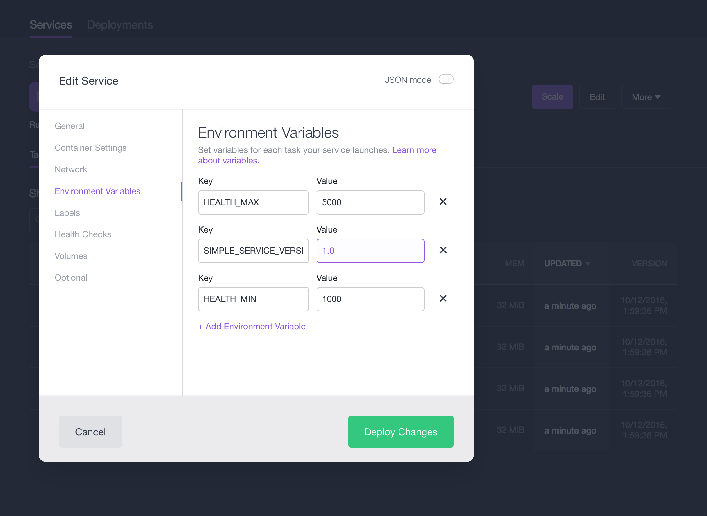
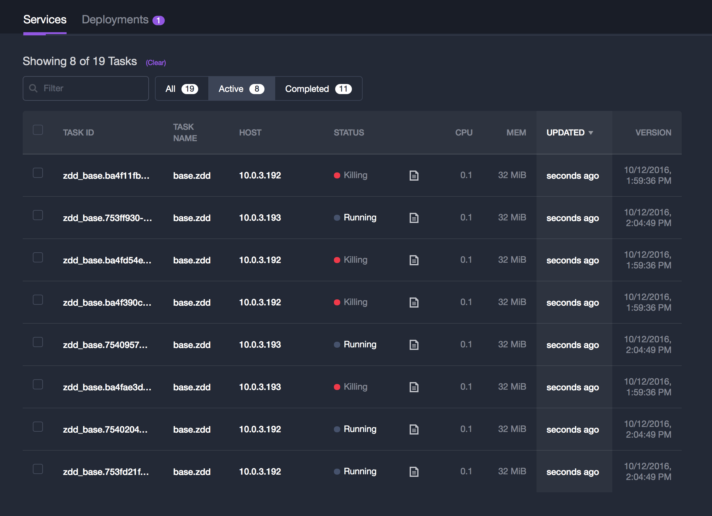
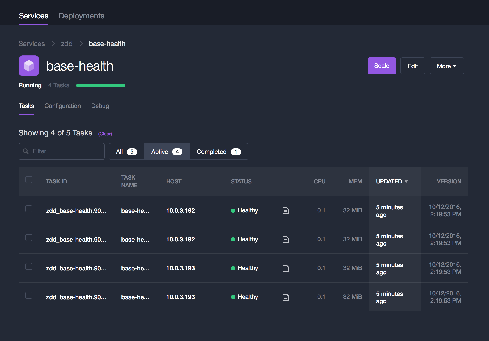

# Zero Downtime Deployments Lab

This Zero Downtime Deployments (ZDD)lab aims at providing an introduction to DC/OS service deployments.
It serves as a step-wise guide how to deploy new versions of a DC/OS service without causing downtimes.

We will do the following in the ZDD lab:

1. A simple rolling upgrade using the [default behaviour](#default-behaviour), without and with health checks
1. A [canary deployment](#canary-deployment)
1. A [Blue-Green deployment](#blue-green-deployment)

Throughout the ZDD lab we will be using [simpleservice](https://github.com/mhausenblas/simpleservice) that 
allows us to simulate certain behaviour incl. versions and health checks.

Prerequisites for this lab are:

- A running [DC/OS 1.8](https://dcos.io/releases/1.8.4/) cluster with at least one private agent, see also [installation](https://dcos.io/install/) if you don't have one yet.
- The [DC/OS CLI](https://dcos.io/docs/1.8/usage/cli/) installed and configured. 
- The [jq](https://stedolan.github.io/jq/) tool, command-line JSON processor, installed.

I'd also suggest that as a preparation you have a look at the [health checks](https://mesosphere.github.io/marathon/docs/health-checks.html) and [readiness checks](https://mesosphere.github.io/marathon/docs/readiness-checks.html) docs.

## Default behaviour

### Without health checks

To explore the default deployment behaviour of DC/OS services we're using [base.json](default/base.json).
This launches a service with the ID `/zdd/base` with 4 instances of `simpleservice`, without health checking, and initially in the version `0.9`:

    $ dcos marathon app add default/base.json

Now we should be able to verify that `simpleservice` is running and there are indeed 4 instances (tasks) available:

    $ dcos marathon task list /zdd/base
    APP        HEALTHY          STARTED              HOST     ID
    /zdd/base    True   2016-10-12T11:38:56.845Z  10.0.3.192  zdd_base.75440e42-9070-11e6-aae4-3a4b79075094
    /zdd/base    True   2016-10-12T11:38:56.861Z  10.0.3.193  zdd_base.75443553-9070-11e6-aae4-3a4b79075094
    /zdd/base    True   2016-10-12T11:38:56.878Z  10.0.3.193  zdd_base.754546c5-9070-11e6-aae4-3a4b79075094
    /zdd/base    True   2016-10-12T11:38:56.884Z  10.0.3.192  zdd_base.7544f8a4-9070-11e6-aae4-3a4b79075094

The last column in above output is the so called `task ID` which we will be using in the following to refer to a single instance of `simpleservice`.

Next, let's see what version of `simpleservice` is running. For this we need to invoke one of the 4 instances of `simpleservice`, so we pick a random one and try to discover where it is available:

    $ dcos marathon task show zdd_base.75443553-9070-11e6-aae4-3a4b79075094
    {
      "appId": "/zdd/base",
      "host": "10.0.3.193",
      "id": "zdd_base.75443553-9070-11e6-aae4-3a4b79075094",
      "ipAddresses": [
        {
          "ipAddress": "10.0.3.193",
          "protocol": "IPv4"
        }
      ],
      "ports": [
        1765
      ],
      "servicePorts": [
        10000
      ],
      "slaveId": "145f052d-8bcb-457f-b1e6-b1b4e2cdf787-S1",
      "stagedAt": "2016-10-12T11:38:55.952Z",
      "startedAt": "2016-10-12T11:38:56.861Z",
      "state": "TASK_RUNNING",
      "version": "2016-10-12T11:38:55.934Z"
    }

From the above output we learn that the instance `zdd_base.75443553-9070-11e6-aae4-3a4b79075094` of `simpleservice` is available via `10.0.3.193:1765`. Since we didn't deploy the `simpleservice` onto a public agent, it is only available and accessible from with the cluster. We hence ssh into the DC/OS cluster to invoke the previously mentioned instance, for example like so:

    $ ssh -A core@$MASTER_IP_ADDRESS
    CoreOS stable (1068.9.0)
    Last login: Wed Oct 12 10:39:38 2016 from 46.7.174.29
    Update Strategy: No Reboots
    Failed Units: 1
      update-engine.service
    core@ip-10-0-6-211 ~ $ curl 10.0.3.193:1765/endpoint0
    {"host": "10.0.3.193:1765", "version": "0.9", "result": "all is well"}

So we see from above output that indeed all is well and `simpleservice` is serving in version `0.9`. At the same time, we can have a look at the logs of this instance to verify that it has been invoked (in a new terminal):

    $ dcos task log --follow zdd_base.75443553-9070-11e6-aae4-3a4b79075094 stderr
    I1012 11:38:56.152595 27678 docker.cpp:815] Running docker -H unix:///var/run/docker.sock run --cpu-shares 102 --memory 33554432 -e MARATHON_APP_VERSION=2016-10-12T11:38:55.934Z -e HOST=10.0.3.193 -e MARATHON_APP_RESOURCE_CPUS=0.1 -e SIMPLE_SERVICE_VERSION=0.9 -e MARATHON_APP_RESOURCE_GPUS=0 -e HEALTH_MAX=5000 -e MARATHON_APP_DOCKER_IMAGE=mhausenblas/simpleservice:0.4.0 -e PORT_10000=1765 -e MESOS_TASK_ID=zdd_base.75443553-9070-11e6-aae4-3a4b79075094 -e PORT=1765 -e MARATHON_APP_RESOURCE_MEM=32.0 -e PORTS=1765 -e MARATHON_APP_RESOURCE_DISK=0.0 -e HEALTH_MIN=1000 -e MARATHON_APP_LABELS= -e MARATHON_APP_ID=/zdd/base -e PORT0=1765 -e LIBPROCESS_IP=10.0.3.193 -e MESOS_SANDBOX=/mnt/mesos/sandbox -e MESOS_CONTAINER_NAME=mesos-145f052d-8bcb-457f-b1e6-b1b4e2cdf787-S1.76d75960-dd4d-49c1-b320-b8f466353927 -v /var/lib/mesos/slave/slaves/145f052d-8bcb-457f-b1e6-b1b4e2cdf787-S1/frameworks/145f052d-8bcb-457f-b1e6-b1b4e2cdf787-0000/executors/zdd_base.75443553-9070-11e6-aae4-3a4b79075094/runs/76d75960-dd4d-49c1-b320-b8f466353927:/mnt/mesos/sandbox --net host --name mesos-145f052d-8bcb-457f-b1e6-b1b4e2cdf787-S1.76d75960-dd4d-49c1-b320-b8f466353927 mhausenblas/simpleservice:0.4.0
    2016-10-12T11:38:56 INFO This is simple service in version v0.9 listening on port 1765 [at line 101]
    2016-10-12T12:00:36 INFO /endpoint0 serving from 10.0.3.193:1765 has been invoked from 10.0.6.211 [at line 59]
    2016-10-12T12:00:36 INFO 200 GET /endpoint0 (10.0.6.211) 1.04ms [at line 1946]

Now, we update the version of `simpleservice` by changing `SIMPLE_SERVICE_VERSION` to `1.0`, either through locally editing `base.json` and using the CLI command `dcos marathon app update /zdd/base < default/base.json` or via the DC/OS UI as shown in the following:

Once you hit the `Deploy Changes` button you should see something like the following:

Notice the old (`0.9`) instances being killed and the new (`1.0`) ones running, overall we have 8 tasks active. To verify if the new version is available we again (from within the cluster) invoke one of the instances as shown previously:

    core@ip-10-0-6-211 ~ $ curl 10.0.3.193:27670/endpoint0
    {"host": "10.0.3.193:27670", "version": "1.0", "result": "all is well"}

Also, notice that none of the instances in the DC/OS UI is showing healthy. This is because DC/OS doesn't know anything about the health status. Let's change that.

### With health checks

To explore the default deployment behaviour of DC/OS services with health checkes, we're using [base-health.json](default/base-health.json).
This launches a service with the ID `/zdd/base-health` with 4 instances of `simpleservice`, with health checking, and initially in the version `0.9`:

    $ dcos marathon app add default/base-health.json

What we now see in the DC/OS UI is the following:

And indeed, as expected, DC/OS can now tell that all instances are healthy, thanks to the following snippet in `base-health.json` (note that besides `path` all other fields are actually the default values):

    "healthChecks": [{
        "protocol": "HTTP",
        "path": "/health",
        "gracePeriodSeconds": 300,
        "intervalSeconds": 60,
        "timeoutSeconds": 20,
        "maxConsecutiveFailures": 3,
        "ignoreHttp1xx": false
    }]

Alternatively, you can check the health of the `/zdd/base-health` service using the DC/OS CLI and `jq` like so:

    $ dcos marathon app show /zdd/base-health | jq '.tasks[].healthCheckResults[]'
    {
      "alive": true,
      "consecutiveFailures": 0,
      "firstSuccess": "2016-10-12T13:20:03.005Z",
      "lastFailure": null,
      "lastFailureCause": null,
      "lastSuccess": "2016-10-12T13:27:01.323Z",
      "taskId": "zdd_base-health.90056376-907e-11e6-aae4-3a4b79075094"
    }
    {
      "alive": true,
      "consecutiveFailures": 0,
      "firstSuccess": "2016-10-12T13:20:03.434Z",
      "lastFailure": null,
      "lastFailureCause": null,
      "lastSuccess": "2016-10-12T13:27:01.795Z",
      "taskId": "zdd_base-health.90056377-907e-11e6-aae4-3a4b79075094"
    }
    {
      "alive": true,
      "consecutiveFailures": 0,
      "firstSuccess": "2016-10-12T13:20:03.602Z",
      "lastFailure": null,
      "lastFailureCause": null,
      "lastSuccess": "2016-10-12T13:27:00.691Z",
      "taskId": "zdd_base-health.9004a024-907e-11e6-aae4-3a4b79075094"
    }
    {
      "alive": true,
      "consecutiveFailures": 0,
      "firstSuccess": "2016-10-12T13:20:00.989Z",
      "lastFailure": null,
      "lastFailureCause": null,
      "lastSuccess": "2016-10-12T13:27:02.398Z",
      "taskId": "zdd_base-health.9004c735-907e-11e6-aae4-3a4b79075094"
    }

And, of course, as in the first case without health checks we can use `dcos marathon task list /zdd/base-health` to explore the 4 instances and verify if they serve the right version (`0.9`). Note, however, that in contrast to the previous case, the tasks now have a `healthCheckResults` array which provides you with details on what is going on concerning the health checks DC/OS performs.

Let's now simulate a case where the health checks fail (time out), for example, because of an internal service failure or an integration point not being available. For this, we need to change two things: the `healthChecks` in `base-health.json` (either locally + CLI command `dcos marathon app update /zdd/base-health < default/base-health.json` or via the DC/OS UI) and as well as the `HEALTH_MIN`, `HEALTH_MAX`, and `SIMPLE_SERVICE_VERSION` env variables, resulting in:

    {
      "id": "/zdd/base-health",
      "instances": 4,
      "cpus": 0.1,
      "mem": 32,
      "container": {
        "type": "DOCKER",
        "docker": {
          "image": "mhausenblas/simpleservice:0.4.0",
          "network": "HOST"
        }
      },
      "env": {
        "HEALTH_MIN": "1000",
        "HEALTH_MAX": "5000",
        "SIMPLE_SERVICE_VERSION": "1.0"
      },
      "healthChecks": [{
        "protocol": "HTTP",
        "path": "/health",
        "gracePeriodSeconds": 300,
        "intervalSeconds": 30,
        "timeoutSeconds": 4,
        "maxConsecutiveFailures": 20,
        "ignoreHttp1xx": false
      }]
    }

Note that we've changed `timeoutSeconds` to `4`, meaning that if it takes longer than 4 sec for the `/health` endpoint to respond with `200` the instance is considered unhealthy. Since `HEALTH_MIN` is set to `1000` there should be at least one instance randomly assigned with a delay below 4 sec and hence we expect at least one unhealthy task. If you see all healthy, repeat the deployment or change the values so that it's more likely to happen. 

Further, note that we changed `SIMPLE_SERVICE_VERSION` to `1.0`, hence rolling out a new version, as well as increased `maxConsecutiveFailures` to `20` to give DC/OS enough opportunities to launch healthy instances and finally decreased `intervalSeconds` to `30` to perform the checks faster.

Once the deployment has been kicked off, you should see a sequence like the following (note that the actual sequence will differ, depending on how many instances have been randomly assigned time outs above the 4 sec threshold and hence are not considered not healthy by DC/OS):

[STEP 0](img/base-health-update-deployment-step0.png) | [STEP 1](img/base-health-update-deployment-step1.png) | [STEP 2](img/base-health-update-deployment-step2.png) | [STEP 3](img/base-health-update-deployment-step3.png) | [STEP 4](img/base-health-update-deployment-step4.png)

Now, what happened? We requested 4 running, healthy instances of `simpleservice`. DC/OS recognizes the unhealthy instances and re-starts them until it has achieved the goal.

Note also that if you only want to scale the app (keeping the same version) you can use the CLI command `dcos marathon app update /zdd/base-health instances=5` to achieve this.

## Canary deployment

## Blue-Green deployment